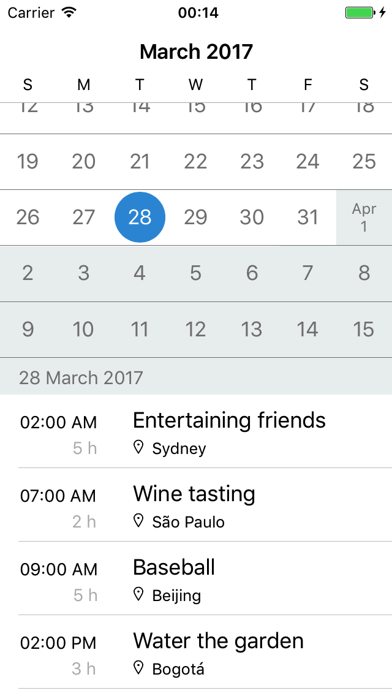

# Calendar

Calendar is a iOS app with calendar and agenda views. 

The Calendar view is a continuously scrolling view that allows the user to browse between days of the year. Tapping on a date should update the information displayed in the Agenda view.

The Agenda view is a continuously scrolling view that allows the user to browse events in chronological order. Moving between dates should update the information displayed in the Calendar view.

  

